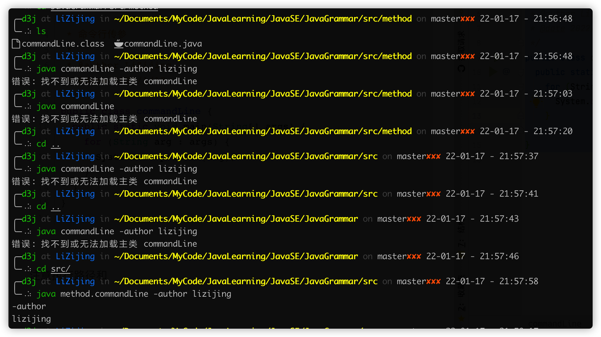

# Java SE 复习笔记

## 1. 前置入门

### 1.1 Java 三大版本

JavaSE：标准版（桌面程序、控制台开发...）

JavaME：嵌入式开发（手机、小家电...）

JavaEE：企业级开发（web 端、服务器开发...）

### 1.2 JDK、JRE、JVM

**JDK：Java Development Kit**

Java 开发者工具

**JRE：Java Runtime Environment**

Java 运行时环境

**JVM：JAVA Virtual Machine**

Java 虚拟机，实现 Java 跨平台的基础

## 2. Java 基础语法

### 2.1 标识符

| 用途                 | 关键字   |            |          |              |            |           |        |
| :------------------- | :------- | :--------- | -------- | :----------- | ---------- | --------- | ------ |
| 访问控制             | private  | protected  | public   |              |            |           |        |
| 类，方法和变量修饰符 | abstract | class      | extends  | final        | implements | interface | native |
|                      | new      | static     | strictfp | synchronized | transient  | volatile  |        |
| 程序控制             | break    | continue   | return   | do           | while      | if        | else   |
|                      | for      | instanceof | switch   | case         | default    |           |        |
| 错误处理             | try      | catch      | throw    | throws       | finally    |           |        |
| 包相关               | import   | package    |          |              |            |           |        |
| 基本类型             | boolean  | byte       | char     | double       | float      | int       | long   |
|                      | short    | null       | true     | false        |            |           |        |
| 变量引用             | super    | this       | void     |              |            |           |        |
| 保留字               | goto     | const      |          |              |            |           |        |

标识符以字母（A-Z、a-z）或美元符（$）或下划线（_）开始

首字符外可以是字母、美元符、下划线、数字构成的的任何字符组合

标识符大小写敏感

### 2.2 数据类型

Java 是**强类型语言**，要求变量的使用必须严格符合规定，所有变量必须先定义后使用

Java 数据类型分为两大类：

- 基本类型（primitive type）
- 引用类型（reference type）

#### 2.2.1 基本类型


- 数值类型

  - 整数类型

    - byte：占用 1 个字节，可表示范围：-128 ~ 127

    - short：占用 2 个字节，可表示范围：-32768 ~ 32767

    - int：占用 4 个字节，可表示范围：-2147483648 ~ 2147483647

    - long：占用 8 个字节，可表示范围：-9223372036854775808 ~ 9223372036854775807

  - 浮点类型

    - float：占用 4 个字节
  - double：占用 8 个字节
  
- 字符类型
  
    - char：占用 2 个字节

- 布尔类型

  - 只占用 1 位，其值只有 true 和 false

> **字节**
>
> 位（bit，比特）：是计算机内部数据存储的最小单位
>
> 字节（byte）：是计算机中数据处理的最小单位，习惯上用大写 B 来表示
>
> 1B（byte，字节）=8bit（位）
>
> 字符：计算机中使用的字母，数字，字和符号
>
> **浮点数**
>
> 浮点数存在舍入误差，避免使用浮点数进行比较
>
> **字符**
>
> 所有字符的本质还是数字==>Unicode 编码：\u0000 ~ \uFFFF

#### 2.2.2 类型转换

运算中，不同类型的数据先转换成同一种类型在进行运算

> 优先级：
>
> 低 --------------------------------------------------------- >高
>
> byte=>short=>char=>int=>long=>float=>double

- 强制类型转换
  - 高到低需要强制转换
  - （类型）变量名
- 自动类型转换
  - 低到高自动转换

### 2.3 变量

变量：可以变化的量

1. 每个变量必须有类型，可以是基本类型或引用类型
2. 变量名必须是合法的标识符
3. 变量声明必须是合法的语句

变量作用域：

- 类变量
- 实例变量
- 局部变量

### 2.4 运算符

- 算数运算符：+，-，*，/，%，++，--
- 赋值运算符：=
- 关系运算符：>，<，>=，<=，==，!=，**instanceof**
- 逻辑运算符：&&，||，！
- 位运算符：&，|，^，~，>>，<<，>>>
- 条件运算符：？：
- 扩展赋值运算符：+=，-=，*=，/=

> **instanceof**
>
> 作用：测试对象是否为类的一个实例化，返回 boolean 的数据结果
>
> **++/--**
>
> 在前面：先自增/自减再使用
>
> 在后面：先使用再自增/自减
>
> **Java 幂运算**
>
> ```Java
> Math.pow(底数,指数);
> ```
>
> **字符串连接**
>
> “+” 可以用于字符串连接

------

**位运算**

位运算效率极高

```java
  A  = 0011 1100;//60
  B  = 0000 1101;//13

 A&B = 0000 1100;//与
 A|B = 0011 1101;//或
 A^B = 0011 0001;//异或，相同为 0 不同为 1
  ~B = 1111 0010;//非
B<<1 = 0001 1010;//左移，左移一位相当于 *2，B<<1=26
B>>1 = 0000 0110;//右移，右移一位相当于 /2，B>>1=6
```

------

### 2.5 包机制

**package**

Java 提供了包机制实现类的命名空间

### 2.5 JavaDoc

> [Java 文档注释 | 菜鸟教程 (runoob.com)](https://www.runoob.com/java/java-documentation.html)
>
> [javadoc (oracle.com)](https://docs.oracle.com/javase/8/docs/technotes/tools/windows/javadoc.html)
>
> [Javadoc命令操作的那些事（IDEA和命令生成Javadoc文档等详细操作与解释） | 码农家园 (codenong.com)](https://www.codenong.com/cs106502037/)

生成 Java API 文档用，例：

```java
/**
 * @author 作者
 * @date 日期
 * @version 版本
 * @since 指明需要最早使用的 jdk 版本
 * @return 返回值情况
 * @throws 异常抛出情况
 */
```

## 3. 流程控制

### 3.1 用户交互 Scanner 对象

**Scanner 对象**

Java5 的新特性，可以来获取用户的输入

```java 
Scanner scanner = new Scanner(System.in);
```

- next()：
  - 一定要读取到有效字符串才可以结束输入
  - 对输入有效字符之前的空白，next() 方法自动将其去掉
  - 只有输入有效字符后才将其后面输入的空白作为分隔符或结束符
  - next() 不能得到带有空格的字符串
- nextLine()：
  - 以 Enter 作为结束符，nextLine() 方法返回的是 Enter 前的所有字符
  - 可以获得空白

### 3.2 顺序结构

最基本的结构，默认从上到下顺序执行

### 3.3 选择结构

-  if 单选择结构

  - ```java
    if(条件){//条件为 true 的执行语句};
    ```

- if 双选择结构

  - ```java
    if(条件){
        //条件为 true 的执行语句
    }else{
        //条件为 false 的执行语句
    };
    ```

- if 多选择结构

  - ```java
    if(条件 1){
        //条件1为 true 的执行语句
    }else if(条件 2){
        //条件2为 true 的执行语句
    }else if(条件 3){
        //条件3为 true 的执行语句
    }else{
        //以上条件都不为 true 的执行语句
    };
    ```

- switch-case 多选择结构

  - ```java
    switch(表达式){
        case value1:
            //语句
            break;
        case value2:
            //语句
            break;
        default:
            //语句
    }
    ```

  - switch 表达式中变量类型可以是 byte、short、int、char

  - **从 Java7 开始支持 String，同时 case 标签必须是字符串常量或者字面量**

  - case 穿透现象：缺少 break 导致后续 case 语句块中也被执行

### 3.4 循环结构

- while 循环

  - ```java
    while(表达式){
        //执行语句
    };
    ```

- do...while 循环

  - ```java
    do{
        //执行语句，一定会执行一次
    }while(表达式);//表达式为 false 跳出循环
    ```

- for 循环

  - ```java
    for(条件初始化;布尔表达式;条件更新){//表达式为 false 跳出循环
        //执行语句
    };
    ```

  - 条件初始化可以为空语句

    - ```java
      int i=0
      for(;i<10;i++){};
      ```

- 增强 for 循环

  - ```java
    int[] nums = {1,2,3,4,5};
    for(int x:nums){
        //循环体
    };
    ```

  - 主要用于数组和集合

  - idea for 循环快捷键：i.for

- break 中断

  - 强制跳出循环，不执行后续循环

- continue

  - 终止循环的某次过程，跳过该次继续接下来的循环

- label

  - break/continue + label：结束循环/该次循环，跳至 label 处

## 4. 方法（函数）

### 4.1 设计方法的原则

方法的本质是功能块，尽可能保证方法的**原子性**

### 4.2 方法的定义

```java
修饰符 返回值类型 方法名(参数类型 参数名){
    方法体;
    return 返回值;
}
```

### 4.3 方法的调用

```
对象名.方法名
```

**Java 都是值传递，没有引用传递**

### 4.4 方法的重载

重载：在一个类中，有相同的函数名称，但形参不同的函数

**重载规则：**

1. 方法名称必须相同
2. 参数列表必须不同：**个数不同、类型不同、参数排列顺序不同**
3. 方法的返回值类型可以相同也可以不同
4. 仅仅返回值类型不同不构成方法的重载

**实现理论：**

方法名称相同时，编译器根据调用方法的参数个数、参数类型等逐个进行匹配，选择对应的方法，若匹配失败则编译报错。

### 4.5 命令行传参

```java
package method;

/**
 * 命令行传参
 *
 * @author LiZijing
 * @date 2022/1/17
 */
public class commandLine {
  public static void main(String[] args) {
    for (String arg : args) {
      System.out.println(arg);
    }
  }
}

```



注意执行路径和执行方法

### 4.6 可变参数

在 JDK1.5 开始，Java 支持传递同类型的可变参数

在方法声明中，**在指定参数类型后面加一个省略号 (...) 即可**

一个方法中只能指定一个可变参数，它必须是方法的最后一个参数，任一普通参数必须在其之前声明

**本质是一个数组**

```Java
package method;

/**
 * 可变参数
 *
 * @author LiZijing
 * @date 2022/1/17
 */
public class VariableParam {
  public static void main(String[] args) {
    VariableParam variableParam = new VariableParam();
    variableParam.varParams(1, 2, 3);
    variableParam.varParams(new int[] {4, 5, 6});
  }

  public void varParams(int... nums) { //本质是一个数组
    for (int num : nums) {
      System.out.println(num);
    }
  }
}
```

### 4.7 递归

自身调用，具体看算法分析，此处不详讲
