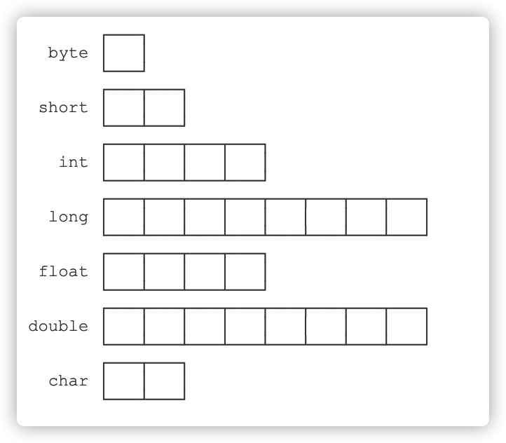
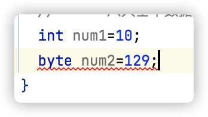

# Java SE 复习笔记

## 1. 前置入门

### 1.1 Java 三大版本

JavaSE：标准版（桌面程序、控制台开发...）

JavaME：嵌入式开发（手机、小家电...）

JavaEE：企业级开发（web 端、服务器开发...）

### 1.2 JDK、JRE、JVM

**JDK：Java Development Kit**

Java 开发者工具

**JRE：Java Runtime Environment**

Java 运行时环境

**JVM：JAVA Virtual Machine**

Java 虚拟机，实现 Java 跨平台的基础

## 2. Java 基础语法

### 2.1 标识符

| 用途                 | 关键字   |            |          |              |            |           |        |
| :------------------- | :------- | :--------- | -------- | :----------- | ---------- | --------- | ------ |
| 访问控制             | private  | protected  | public   |              |            |           |        |
| 类，方法和变量修饰符 | abstract | class      | extends  | final        | implements | interface | native |
|                      | new      | static     | strictfp | synchronized | transient  | volatile  |        |
| 程序控制             | break    | continue   | return   | do           | while      | if        | else   |
|                      | for      | instanceof | switch   | case         | default    |           |        |
| 错误处理             | try      | catch      | throw    | throws       | finally    |           |        |
| 包相关               | import   | package    |          |              |            |           |        |
| 基本类型             | boolean  | byte       | char     | double       | float      | int       | long   |
|                      | short    | null       | true     | false        |            |           |        |
| 变量引用             | super    | this       | void     |              |            |           |        |
| 保留字               | goto     | const      |          |              |            |           |        |

标识符以字母（A-Z、a-z）或美元符（$）或下划线（_）开始

首字符外可以是字母、美元符、下划线、数字构成的的任何字符组合

标识符大小写敏感

### 2.2 数据类型

Java 是**强类型语言**，要求变量的使用必须严格符合规定，所有变量必须先定义后使用

Java 数据类型分为两大类：

- 基本类型（primitive type）
- 引用类型（reference type）

#### 2.2.1 基本类型

- 数值类型

  - 整数类型

    - byte：占用 1 个字节，可表示范围：-128 ~ 127

      

      <!--数据范围越界导致报错-->

    - short：占用 2 个字节，可表示范围：-32768 ~ 32767

    - int：占用 4 个字节，可表示范围：-2147483648 ~ 2147483647

    - long：占用 8 个字节，可表示范围：-9223372036854775808 ~ 9223372036854775807

  - 浮点类型

    - float：占用 4 个字节
    - double：占用 8 个字节

  - 字符类型

    - char：占用 2 个字节

- 布尔类型

  - 只占用 1 位，其值只有 true 和 false

> **字节**
>
> 位（bit，比特）：是计算机内部数据存储的最小单位
>
> 字节（byte）：是计算机中数据处理的最小单位，习惯上用大写 B 来表示
>
> 1B（byte，字节）=8bit（位）
>
> 字符：计算机中使用的字母，数字，字和符号
>
> **浮点数**
>
> 浮点数存在舍入误差，避免使用浮点数进行比较
>
> **字符**
>
> 所有字符的本质还是数字==>Unicode 编码：\u0000 ~ \uFFFF

#### 2.2.2 类型转换

运算中，不同类型的数据先转换成同一种类型在进行运算

> 优先级：
>
> 低 --------------------------------------------------------- >高
>
> byte=>short=>char=>int=>long=>float=>double

- 强制类型转换
  - 高到低需要强制转换
  - （类型）变量名
- 自动类型转换
  - 低到高自动转换

### 2.3 变量

变量：可以变化的量

1. 每个变量必须有类型，可以是基本类型或引用类型
2. 变量名必须是合法的标识符
3. 变量声明必须是合法的语句

变量作用域：

- 类变量
- 实例变量
- 局部变量
